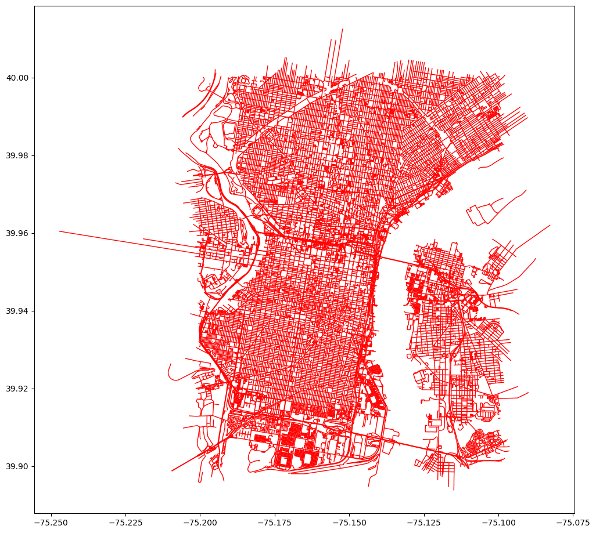
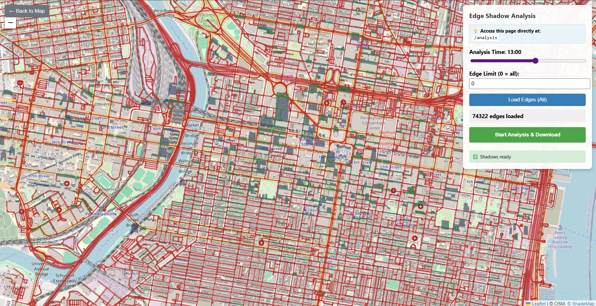
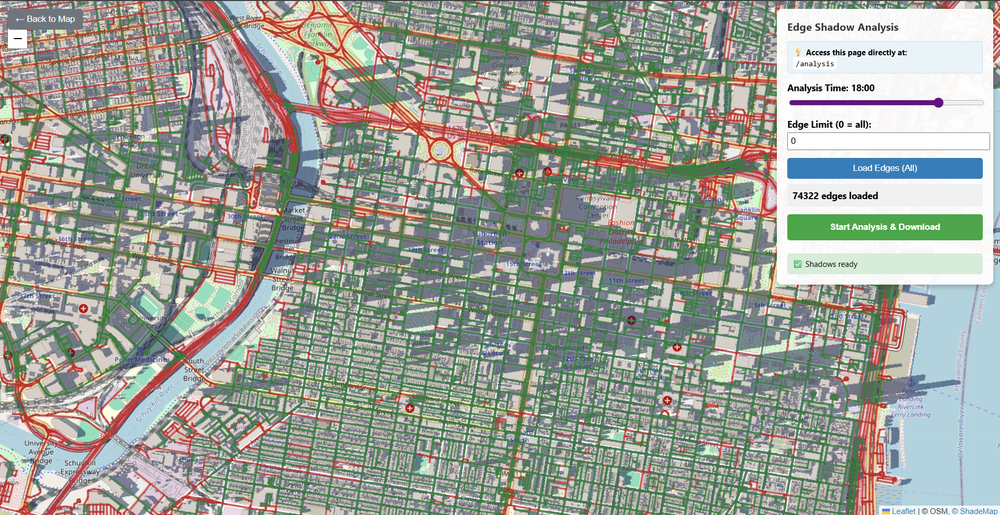

# PennApps 2025: ShadeNav

Climate change has created a devastating feedback loop: rising temperatures make walking unbearable, forcing people to drive more, pumping more greenhouse gases into the atmosphere, making cities even hotter.

**ShadeNav breaks this cycle** by making walking comfortable again through intelligent shade-optimized routing. Using satellite analysis and real-time sun positioning, we find paths that maximize shade coverage - because shaded areas feel up to 20°F cooler than direct sunlight.

A comprehensive route-planning system for downtown Philadelphia that optimizes paths based on shade coverage and essential services using advanced satellite imagery analysis and OpenStreetMap data.

See: https://devpost.com/software/shadenav


## Project Structure

- `frontend/`: Vite + React + TypeScript with Leaflet map component for interactive visualization
- `backend/`: Advanced tree detection and waypoint pathfinding system with satellite data analysis

## Features

### Interactive Map of Downtown Philadelphia
- **High-Resolution Urban Mapping**: Street-level visualization with building footprints and infrastructure
- **Real-time Interface**: Interactive Leaflet map with dynamic route rendering and gradient shade analysis
- **OpenStreetMap Integration**: Comprehensive road networks and urban data foundation

### Advanced Shadow Simulation System
- **Building Height Analysis**: Precise height extraction from OpenStreetMap and satellite data
- **Solar Ray Tracing**: Computational geometry for sun ray simulation at any time/date
- **Dynamic Shadow Mapping**: Real-time calculations using sun position, building geometry, and seasonal variations
- **Multi-Source Shade Detection**: Combines building shadows with tree canopy coverage
- **Temporal Prediction**: Forecasts shade patterns throughout the day

### Intelligent Pathfinding Algorithms
- **Dijkstra's & A* Search**: Shortest path computation with shade-weighted edge costs and heuristic optimization
- **Custom Shade Metrics**: Edge weights incorporating shade coverage, temperature differentials, and comfort indices
- **Multi-Objective Optimization**: Balances route efficiency with shade maximization
- **Dynamic Re-routing**: Real-time path adaptation based on sun position changes

### Tree Detection & Environmental Analysis
- **Satellite Analysis**: Google Earth Engine vegetation detection (NDVI, NDWI, GNDVI indices)
- **Multi-Strategy Fusion**: Weighted combination of satellite and OpenStreetMap data
- **Ultra-Fine Resolution**: 5m grid analysis with density scoring for precise tree detection

### Smart Waypoint Integration
- **Essential Services**: Water fountains, convenience stores, and climate-controlled spaces
- **Adaptive Selection**: Dynamic waypoint adjustment based on route length and weather conditions

## Quickstart

### Backend Setup

1. **Navigate to backend directory:**
   ```bash
   cd backend
   ```

2. **Install dependencies:**
   ```bash
   python -m venv .venv
   .\.venv\Scripts\Activate.ps1  # Windows
   # or
   source .venv/bin/activate      # macOS/Linux
   pip install -r requirements.txt
   ```

3. **Set up Google Earth Engine (for satellite data):**
   ```bash
   # Install Earth Engine API
   pip install earthengine-api
   
   # Authenticate (this will open a browser window)
   python -c "import ee; ee.Authenticate()"
   
   # Test authentication
   python -c "import ee; ee.Initialize(); print('Earth Engine working!')"
   ```

4. **Optional: Configure project settings:**
   ```bash
   # Copy the example environment file
   cp .example.env .env
   
   # Edit .env and add your Google Cloud Project ID (optional)
   # This is only needed if you want to use a specific project
   ```

5. **Run tree detection:**
   ```bash
   python tree_detection.py
   ```

6. **Run waypoint pathfinding:**
   ```bash
   python waypoint_pathfinding.py
   ```

7. **Start the API server:**
   ```bash
   uvicorn app:app --reload --port 8000
   ```

### Frontend Setup

1. **Navigate to frontend directory:**
   ```bash
   cd frontend
   ```

2. **Install dependencies:**
   ```bash
   npm install
   ```

3. **Start development server:**
   ```bash
   npm run dev
   ```

## Pre-generated Data

The backend includes pre-generated JSON files from running the detection systems:

- `tree_positions.json`: 703 detected trees with satellite analysis data
- `waypoints_data.json`: Essential services waypoint data

These files can be used immediately without running the detection algorithms.

## API Integration

The generated JSON files can be easily integrated with frontend applications:

```python
import json

# Load tree data
with open('tree_positions.json', 'r') as f:
    tree_data = json.load(f)

# Access trees
trees = tree_data['trees']
for tree in trees:
    lat, lon = tree['latitude'], tree['longitude']
    density = tree['density']
    source = tree['source']
```

## Development Process

### Developing the graph


Initial street network extraction from OpenStreetMap showing downtown Philadelphia's road infrastructure. This visualization demonstrates the comprehensive coverage of walkable paths that form the foundation of our routing graph.

### Processing edge shadow data


Shadow analysis pipeline in action, processing individual street segments (edges) to calculate shade coverage. The visualization shows the computational process of analyzing building heights and sun angles to determine shadow patterns for each walkable path.

### Profiling edges at different times of day
   

Temporal shadow analysis across different hours of the day, demonstrating how shade patterns shift as the sun moves. Each visualization captures shadow distribution at key times (morning, midday, afternoon, evening), showing the dynamic nature of urban shade coverage that drives our intelligent routing decisions.

## Future Work

### Core Enhancements
- **Crime & Safety Integration**: Balance shade optimization with real-time safety data
- **Accessibility Features**: ADA-compliant routing with wheelchair accessibility
- **Emergency Shelter Network**: Integration with cooling centers for extreme heat events

### Urban Planning Analytics
- **Optimal Shelter Placement**: AI-driven analysis to identify strategic locations for new shade structures that maximize citywide walking comfort
- **Heat Island Mitigation**: Data-driven recommendations for tree planting and infrastructure modifications to reduce urban heat effects
- **Pedestrian Flow Analysis**: Integration with foot traffic data to prioritize shade improvements in high-usage corridors
- **Cost-Benefit Optimization**: ROI analysis for shade infrastructure investments based on pedestrian comfort gains

### Advanced Technologies
- **IoT Sensor Integration**: Real-time temperature and air quality data from city sensors
- **Machine Learning Personalization**: User-specific heat tolerance and comfort preferences
- **Municipal Planning Tools**: City dashboard for pedestrian comfort analytics

## Dependencies

### Core Dependencies
- `osmnx`: OpenStreetMap data processing
- `geopandas`: Geospatial data manipulation
- `pandas`: Data analysis
- `folium`: Interactive mapping
- `numpy`: Numerical computing

### Optional Dependencies
- `earthengine-api`: Google Earth Engine integration for satellite data
- `python-dotenv`: Environment variable management
- `scipy`: Advanced interpolation for satellite data processing